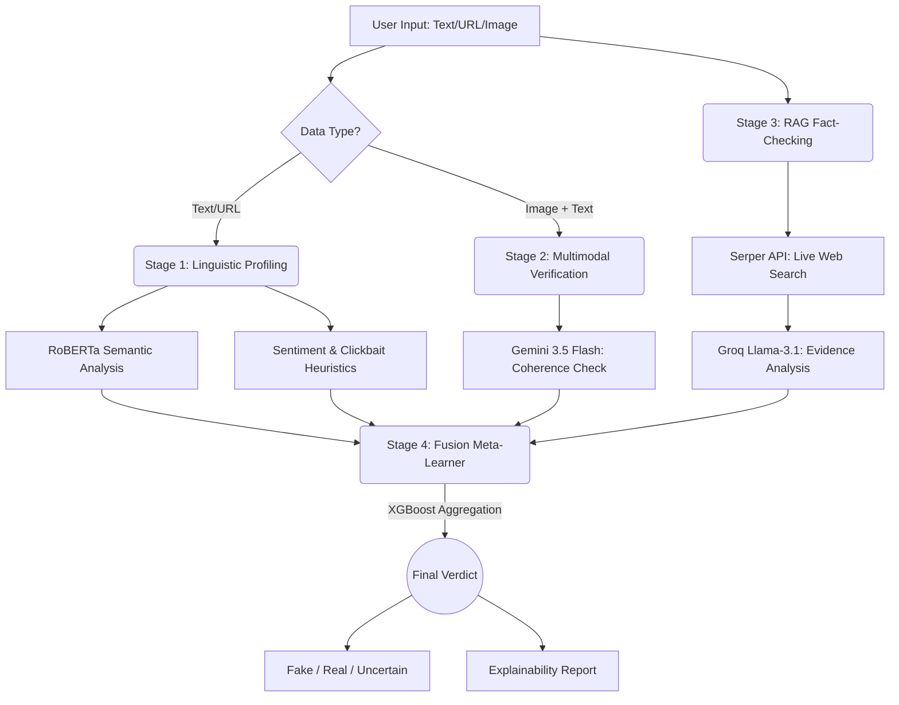

<div align="center">
  <h1>🛡️ Fake News Detection System</h1>
  <h3>Advanced Cloud-Hybrid AI Architecture for Multimodal Misinformation Detection</h3>

  [](https://opensource.org/licenses/MIT)
  [](https://www.python.org/downloads/)
  [](https://fastapi.tiangolo.com/)
  [](https://jagannadharao8-fake-news-detection.hf.space/)
  
  <p align="center">
    A state-of-the-art, multimodal fake news detection system combining local Machine Learning models with cutting-edge Cloud AI APIs for comprehensive text, image, and web-based fact-checking.
  </p>
</div>


---

## 📖 Table of Contents

- [Overview](#-overview)
- [Key Features](#-key-features)
- [Architecture & Pipeline](#-architecture--pipeline)
- [Tech Stack](#-tech-stack)
- [Live Demo](#-live-demo)
- [Getting Started](#-getting-started)
  - [Prerequisites](#prerequisites)
  - [Installation](#installation)
  - [Configuration](#configuration)
- [Usage](#-usage)
- [Repository Structure](#-repository-structure)
- [Known Limitations](#-known-limitations)
- [Contributing](#-contributing)
- [License](#-license)

---

## 🌟 Overview

The **Fake News Detection System** is designed to tackle the growing challenge of digital misinformation. It processes news posts—including text, URLs, and images—in multiple languages, classifying them as **Fake**, **Real**, or **Uncertain**. 

Beyond a simple classification, the system acts as an analytical agent, providing detailed, human-readable explainability reports to justify its verdicts. By leveraging a hybrid architecture, it balances computational efficiency, cost-effectiveness, and deep reasoning capabilities.

---

## ✨ Key Features

- 🧠 **Hybrid AI Architecture**: Synergizes local ML models for rapid inference with powerful Cloud APIs for complex reasoning.
- 🖼️ **Multimodal Analysis**: Processes not only text but also cross-references accompanying images to detect out-of-context or manipulated media.
- 🌐 **Live Web Fact-Checking (RAG)**: Dynamically retrieves breaking news and live evidence from the internet to corroborate or refute claims.
- 🌍 **Multilingual Support**: Automatically detects and translates content from various languages (e.g., Hindi, Telugu) into English before analysis.
- 🔗 **Automated URL Scraping**: Extracts full article content seamlessly from provided links.
- 📊 **Explainable AI (XAI)**: Demystifies the "black box" by generating comprehensive reports detailing how each pipeline stage contributed to the final verdict.

---

## ⚙️ Architecture & Pipeline

When an article or post is submitted, it traverses a sophisticated 4-stage processing pipeline:



### 1. Linguistic Profiling (Local NLP)
- **Semantic Analysis**: A localized, fine-tuned **RoBERTa-base** model assesses the semantic structure and linguistic patterns of deception.
- **Sentiment & Subjectivity**: Uses **TextBlob** to compute emotional polarity and subjectivity.
- **Clickbait Heuristics**: Custom algorithms detect sensationalism (e.g., excessive capitalization, hyperbolic punctuation).

### 2. Multimodal Verification (Cloud Vision)
- Acts as a digital photo-journalist using **Google Gemini 3.5 Flash**.
- Evaluates the coherence between the provided image and the headline, rigorously flagging out-of-context or manipulated visuals.

### 3. Retrieval-Augmented Generation (RAG Fact-Checking)
- **Evidence Retrieval**: Extracts core factual claims and utilizes the **Google Search API (Serper)** to pull top relevant live articles.
- **Logical Assessment**: Feeds retrieved data into **Groq (Llama-3.1)**, which analyzes the evidence to return a definitive `Supports` or `Refutes` verdict.

### 4. Fusion & Explainability (Meta-Learner)
- **Signal Aggregation**: All intermediate signals (RoBERTa score, Gemini analysis, Groq verdict, Sentiment, Clickbait) are aggregated.
- **Final Verdict**: An **XGBoost Meta-Learner** evaluates the combined features to predict the final status (**Fake**, **Real**, or **Uncertain**).
- **Report Generation**: Synthesizes the decision matrix into an easily digestible Explainability Report for the user.

---

## 🛠️ Tech Stack

| Domain | Technologies |
| :--- | :--- |
| **Backend & API** | Python, FastAPI, Uvicorn |
| **Local Machine Learning** | PyTorch, Hugging Face Transformers (RoBERTa), XGBoost |
| **Cloud AI & LLMs** | Google Gemini 3.5 Flash, Groq (Llama-3.1) |
| **Search & Retrieval** | Serper API (Google Search) |
| **NLP Utilities** | TextBlob, NLTK, BeautifulSoup4 |
| **Deployment** | Docker, Hugging Face Spaces |
| **Frontend UI** | HTML5, CSS3, Vanilla JavaScript |

---

## 🚀 Live Demo

Experience the system in action. The application is fully containerized and hosted on Hugging Face Spaces:

👉 **[Try the Live Application](https://jagannadharao8-fake-news-detection.hf.space/)**

---

## 💻 Getting Started

Follow these instructions to set up the project on your local machine for development and testing.

### Prerequisites

- **Python**: 3.8 or higher
- **Git**: For cloning the repository
- API Keys for Google Gemini, Serper, and Groq.

### Installation

1. **Clone the Repository**
   ```bash
   git clone https://github.com/jagannadharao8/Fake-news-detection-using-GENAI-ML-DL-XAI.git
   cd Fake-news-detection-using-GENAI-ML-DL-XAI
   ```

2. **Create a Virtual Environment**
   ```bash
   # Windows
   python -m venv venv
   .\venv\Scripts\activate

   # macOS / Linux
   python3 -m venv venv
   source venv/bin/activate
   ```

3. **Install Dependencies**
   ```bash
   pip install -r requirements.txt
   ```

### Configuration

Create a `.env` file in the root directory and populate it with your API keys:

```env
# Google Gemini API Key for Vision & Translation (https://aistudio.google.com/)
GEMINI_API_KEY=your_gemini_api_key_here

# Serper API Key for Web Searching (https://serper.dev/)
SERPER_API_KEY=your_serper_api_key_here

# Groq API Key for RAG Fact-Checking (https://console.groq.com/)
GROQ_API_KEY=your_groq_api_key_here
```

---

## 🏃 Usage

Start the FastAPI application server locally:

```bash
uvicorn server:app --host 127.0.0.1 --port 8000 --reload
```

- **Web Interface**: Navigate to `http://127.0.0.1:8000` in your browser.
- **API Documentation**: Interactive Swagger UI is available at `http://127.0.0.1:8000/docs`.

---

## 📁 Repository Structure

```text
.
├── artifacts/                # Pre-trained ML weights (RoBERTa & XGBoost)
├── src/                      # Core pipeline logic
│   ├── framing/              # Sentiment & Clickbait heuristic analyzers
│   ├── rag/                  # Groq & Serper integration for fact-checking
│   ├── text/                 # Local NLP model implementations (RoBERTa)
│   └── vlm/                  # Gemini Vision integration logic
├── static/                   # Frontend assets (HTML, CSS, JS)
├── .env.example              # Example environment variables file
├── Dockerfile                # Containerization config for Hugging Face
├── requirements.txt          # Python dependency list
└── server.py                 # FastAPI application entry point
```

---

## ⚠️ Known Limitations

- **Search Dominance**: The RAG system depends on Google Search (via Serper). If a piece of fake news is highly viral and dominates recent search indexing, the retrieval step may temporarily pull corroborated false information.
- **Rate Limiting**: Usage of free-tier API keys for Groq and Gemini imposes strict requests-per-minute limits. High-volume processing may trigger cooldown periods.

---

## 🤝 Contributing

We welcome contributions from the community! If you'd like to improve the system:
1. Fork the repository.
2. Create a new branch (`git checkout -b feature/AmazingFeature`).
3. Commit your changes (`git commit -m 'Add some AmazingFeature'`).
4. Push to the branch (`git push origin feature/AmazingFeature`).
5. Open a Pull Request.

Please check the [Issues](#) page for open tasks.

---

## 📄 License

This project is open-source and available under the [MIT License](LICENSE). *(Note: Ensure a LICENSE file exists in the repository if specifying MIT)*
